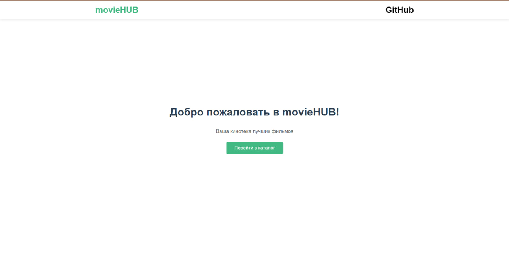
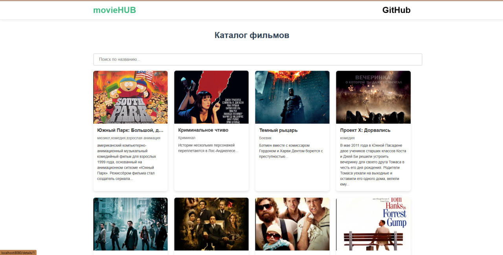
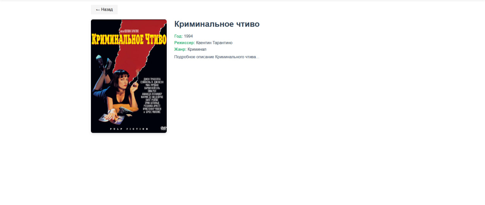

### movieHUB запсук
# 1)проверка установки node
    node -v
    npm -v
# 2) Установите Vue CLI (если нет)
    npm install -g @vue/cli (если нету)
# 3) Клонируйте проект
    git clone https://github.com/Flu337/movieHUB.git
    cd vue-movie-catalog
# 4) Установите зависимости
    npm install
# 5) Запустите сервер разработки
    npm run serve
 ## После успешного запуска откроется браузер по адресу:
http://localhost:8080
# Добро пожаловать!!!

# Каталог

# Страница фильма

